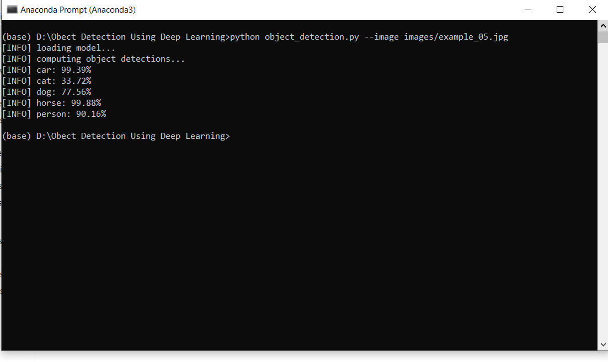
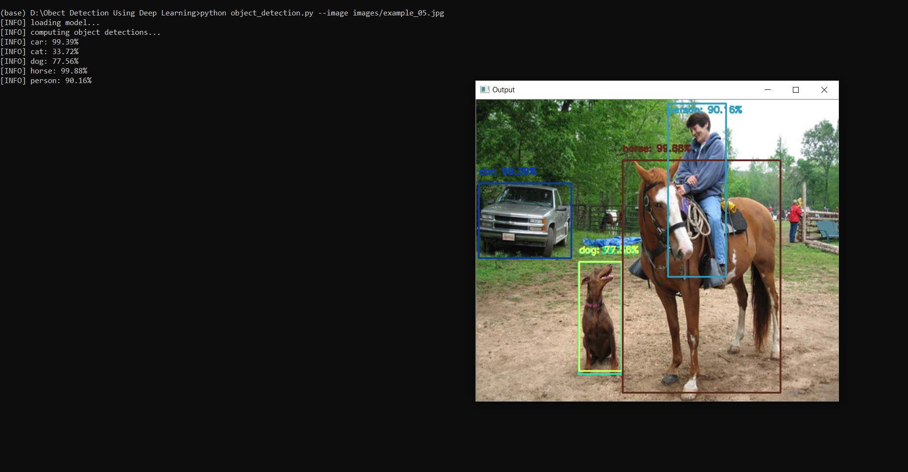

# Object-Detection-Deep-Learning

This is a mini project based on Object Detection with the help of cv2.dnn module of OpenCV and I have used *Transfer Learning* to train this pretrained model with the 21 object classes.

# What is OpenCV ?

OpenCV is a library of programming functions mainly aimed at real-time computer vision. Originally developed by Intel, it was later supported by Willow Garage then Itseez. The library is cross-platform and free for use under the open-source BSD license.
Check website: opencv.org

# What is Transfer Learning?
Transfer learning is a research problem in machine learning that focuses on storing knowledge gained while solving one problem and applying it to a different but related problem. For example, knowledge gained while learning to recognize cars could apply when trying to recognize trucks.

## list of classes :

* background
* aeroplane
* bicycle
* bird
* boat
* bottle
* bus
* car
* cat
* chair
* cow
* diningtable
* dog 
* horse
* motorbike
* person
* pottedplant
* sheep
* sofa
* train
* tvmonitor
 
## How to run this code :

To run this code you have use terminal and go the directory where the file resides run the following code:
```
python filename --image imagefile
i.e. python object_detection.py --image images/example_05.jpg
```



## Output :


